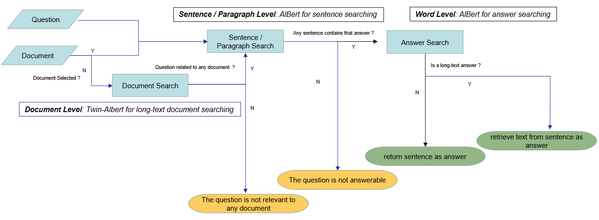

# Document-Based Question And Answering With Hierarchical Search Using Fine-Tuned AlBERT Models

A web application that allows user to upload txt documents and able to answer users' questions related to the uploaded documents based on fine-tuned ALBERT models.

The web application is built on Flask framework with ALBERT models as a search engine built on pytorch framework using transformer libary.

All required packages are listed on requirements.txt. Please follow below commands to create the virtual environment.

```bash
python -m venv .vevn

.venv\Scripts\activate

pip install requirements.txt

```

Lauch the web application

```bash
python application.py
```

For GPU environment, please follow the instruction (https://pytorch.org/get-started/locally/) to install pytorch-gpu compatible with your cuda.

### Model Performance Metrics in Dev Set:

- Twin-Alberts for long text document question pair classification: {'accuracy': 0.991, 'recall': 0.990, 'precision': 0.993, 'f1': 0.991, 'auc': 0.999, 'loss': 0.0277}

- Albert fined tuned on QNLIV2 for sentence selection: {'accuracy': 0.908,'recall':0.909,'precision': 0.908,'f1': 0.908,'auc': 0.964,'loss': 0.256}

- Albert fined tuned on SQUADV2 for answer retrival: {'Exact': 78.657,'F1', 81.936)

### Web UI


### Project Architecture


